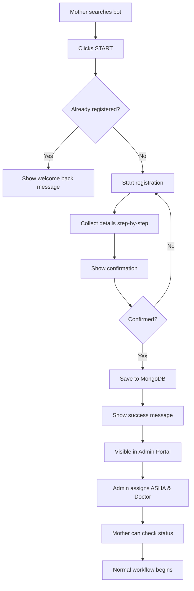

# Telegram Bot - Mother Self-Registration Guide

## 🎯 Overview
Mothers can now self-register through the MatruRaksha Telegram bot! This makes onboarding easier and allows mothers to directly communicate with their healthcare team.

---

## 🚀 Setup Instructions

### 1. Install Dependencies
```bash
cd MatruRaksha
.\env\Scripts\activate.ps1  # Windows
# source env/bin/activate  # Linux/Mac

# Upgrade to compatible versions
pip install --upgrade python-telegram-bot==21.0.1 httpx==0.27.0
```

### 2. Configure Environment Variables
Add to `.env` file:
```env
TELEGRAM_BOT_TOKEN=your_bot_token_here
MONGO_URI=mongodb://localhost:27017
DB_NAME=matruraksha
```

### 3. Start the Bot
```bash
python run_telegram_bot_new.py
```

You should see:
```
✅ Bot token found: 8341113788...
✅ MongoDB connected
🚀 Starting Telegram bot with mother registration...

Bot is running! Press Ctrl+C to stop.
```

---

## 📱 Mother Registration Flow

### Step-by-Step Process

1. **Mother finds bot on Telegram**
   - Search for your bot name
   - Click "START" button

2. **Welcome Message**
   ```
   🌸 Welcome to MatruRaksha! 🌸
   
   I'm here to help you during your pregnancy journey.
   
   Let's get you registered so our healthcare team can assist you.
   
   📝 Please enter your full name:
   ```

3. **Collect Information** (Step by step)
   - ✅ **Full Name** (Required)
   - ✅ **Age** (Required, 15-50)
   - ✅ **Phone Number** (Required)
   - ✅ **Location** (Required - Village, District, State)
   - ✅ **Gestational Week** (Required, 1-42)
   - ⭕ **Weight** (Optional - in kg)
   - ⭕ **Height** (Optional - in cm)
   - ⭕ **Email** (Optional)

   *Note: Optional fields can be skipped*

4. **Confirmation**
   ```
   ✅ Please confirm your details:
   
   👤 Name: Priya Sharma
   📅 Age: 26
   📱 Phone: +919876543210
   📍 Location: Rampur, Varanasi, UP
   🤰 Gestational Week: 20
   ⚖️ Weight: 58 kg
   📏 Height: 160 cm
   
   Is this correct?
   
   [✅ Yes, Register Me] [❌ No, Start Over]
   ```

5. **Success**
   ```
   🎉 Registration Successful! 🎉
   
   Welcome to MatruRaksha, Priya Sharma!
   
   ✅ Your profile has been created.
   ⏳ An admin will assign a healthcare team to you soon.
   
   Once assigned, you will be able to:
   • Receive health assessments
   • Ask questions to your ASHA worker
   • Get advice from your doctor
   • Track your pregnancy progress
   
   Use /help to see available commands.
   Use /status to check your assignment status.
   
   Take care! 💚
   ```

---

## 🖥️ Admin Portal Integration

### Viewing Telegram-Registered Mothers

1. **Go to Admin Portal**
   ```
   http://localhost:8000/admin/mothers
   ```

2. **Identify Telegram Users**
   - Look for **📱 Telegram** badge in "Registration" column
   - See "📱 Self-registered" note under mother's name
   - These mothers have `registered_via: 'telegram'`

3. **Assign Healthcare Team**
   - Click "Assign" button for any mother
   - Select ASHA worker from dropdown
   - Select Doctor from dropdown
   - Click "Save Assignment"

4. **Mother Receives Notification**
   - Once assigned, mother can use `/status` command to see their team

---

## 💬 Bot Commands

### For Mothers

| Command | Description |
|---------|-------------|
| `/start` | Register (new users) or view profile (existing) |
| `/status` | Check assignment status and healthcare team |
| `/help` | Show available commands |
| `/cancel` | Cancel registration process (during signup) |

### Example Usage

**Check Status:**
```
/status
```

**Response:**
```
👤 Your Status

Name: Priya Sharma
Age: 26
Gestational Week: 20
Risk Level: PENDING

Healthcare Team Assignment:
✅ ASHA Worker: Assigned
✅ Doctor: Assigned

Your healthcare team is ready to assist you! 💚
```

---

## 🔄 Complete Workflow



---

## 🗄️ Database Schema

### Mother Document (Telegram Registered)
```javascript
{
  _id: ObjectId,
  name: "Priya Sharma",
  age: 26,
  phone: "+919876543210",
  location: "Rampur, Varanasi, UP",
  gestational_age: 20,
  edd: "2026-05-15",  // Calculated
  weight: 58,  // Optional
  height: 160,  // Optional
  email: "priya@example.com",  // Optional
  telegram_chat_id: "123456789",
  telegram_username: "priyasharma",
  registered_via: "telegram",  // Important!
  active: true,
  risk_level: "pending",
  assigned_asha_id: null,  // Null until admin assigns
  assigned_doctor_id: null,  // Null until admin assigns
  created_at: ISODate("2026-01-01T10:30:00Z"),
  updated_at: ISODate("2026-01-01T10:30:00Z")
}
```

---

## 🛠️ Troubleshooting

### Error: `TypeError: AsyncClient.__init__() got an unexpected keyword argument 'proxies'`

**Solution:**
```bash
pip install --upgrade python-telegram-bot==21.0.1 httpx==0.27.0
```

### Error: `Database connection failed`

**Solution:**
1. Ensure MongoDB is running
2. Check `.env` file for correct `MONGO_URI`
3. Test connection: `python -c "from pymongo import MongoClient; print(MongoClient('mongodb://localhost:27017').server_info())"`

### Bot not responding

**Solution:**
1. Check bot token is correct in `.env`
2. Ensure bot is running (`python run_telegram_bot_new.py`)
3. Check terminal for error messages
4. Try `/start` command again

### Mothers not showing in admin portal

**Solution:**
1. Refresh admin page
2. Check MongoDB: `db.mothers.find({registered_via: 'telegram'})`
3. Ensure admin routes are updated

---

## 📊 Features

### ✅ Implemented
- [x] Self-registration through Telegram
- [x] Step-by-step data collection
- [x] Optional fields (weight, height, email)
- [x] Validation for all inputs
- [x] Confirmation before saving
- [x] Automatic EDD calculation
- [x] MongoDB integration
- [x] Admin portal display
- [x] Telegram badge in admin view
- [x] Status checking
- [x] Help command

### 🚧 Future Enhancements
- [ ] Multilingual support (Hindi, regional languages)
- [ ] Photo upload (ultrasound reports)
- [ ] Appointment scheduling
- [ ] Reminder notifications
- [ ] Health tips delivery
- [ ] Two-way messaging with ASHA/Doctor
- [ ] Assessment submission via bot

---

## 🎉 Benefits

### For Mothers:
- ✅ Easy self-registration (no admin needed)
- ✅ Immediate access to healthcare system
- ✅ Convenient communication channel
- ✅ Status tracking
- ✅ No technical knowledge required

### For Admins:
- ✅ Less manual data entry
- ✅ Direct mother engagement
- ✅ Easy identification of telegram users
- ✅ Better reach to rural areas
- ✅ Scalable onboarding

### For Healthcare Team:
- ✅ More mothers in system
- ✅ Direct communication channel
- ✅ Better engagement
- ✅ Automated workflows

---

## 📞 Support

If you encounter any issues:
1. Check the terminal output for errors
2. Verify all environment variables
3. Ensure MongoDB is running
4. Check bot token validity
5. Review this guide

---

## 📝 Notes

- **Bot must be running** for registration to work
- **MongoDB must be running** to save data
- **Admin assigns team** after registration
- **Mothers can register anytime** using /start
- **Existing users** see welcome back message

---

**Happy Healthcare! 🌸💚**
